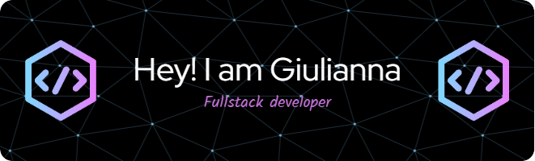

## 👩‍💼🚀 About Me: From Business to Bytes! 🚀👩‍💼

I'm not your typical Full Stack Developer; I'm a seasoned businesswoman with over a decade of experience in the corporate world. But guess what? I ditched the suit for the power of code about four years ago, and I haven't looked back since!

### 💻 Languages

### Technologies

### 🤖 Bots with Brains 
   
I've developed Discord bots for community moderation, giveaways, in-server games, just to mention a few. If you need a bot buddy, hit me up!

### 🚀 Entrepreneurship Bug 
I'm not just about the code; I'm also a **co-founder** of [**dopixel.cloud**](https://dopixel.cloud) and [**dopixel.io**](https://dopixel.io). These 2 are my latest babies, aimed to provide a fullset of tools for web development. 

### ⚡ Fun Fact 
   
I'm a WordPress dev on the side *Shhh! Don't tell anyone!* 

### 🥇 Github Profile Trophy

### 📊 Github Stats

### 🤝 Let's Connect 
Whether you're looking for a coding collaborator, bot guru, or just a friendly chat about tech and business, I'm your partner in crime. Hit me an email at [giulidevs@gmail.com](giulidevs@gmail.com)

---

*Keep coding, keep innovating, and keep smiling!* 😄✨

